## How to use the automatic noise distribution script

The detailed options can be obtained from the script by looking at the help.
You can change things such as the number of cores for parallel processing, which dimensions to use for the DWIs,
the size of the window, to do a full estimation or only non overlapping windows for noise maps, etc.

~~~bash
autodmri_get_distribution -h
~~~

Further information is available from the [documentation](https://autodmri.readthedocs.io/en/stable/) as these are more advanced cases.

### Different options for different cases

We now review some of the common cases with a few examples.

There are four main cases: using the moments or maximum likelihood equations and estimating the distribution from DWIs or noise maps.
For all cases, the output is the standard deviation of the noise (sigma), the number of degrees of freedom of the distribution (N) and the voxels used to identify the distribution (the mask).

When estimating over noise maps (option `--noise_maps`), the mask instead indicates how many voxels were used for each estimation instead.

### Estimating distributions from DWIs

Here I will use an old invivo dataset I have lying around, which you can find in the datasets folder or download [here](https://github.com/samuelstjean/nlsam_data/).
The data looks like this

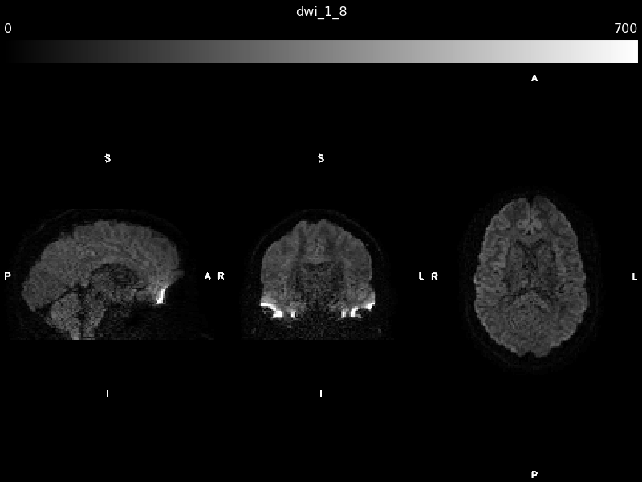

1. With equations using the moments (the default, also accessible with `-m moments`)

~~~bash
autodmri_get_distribution dwi_1_8.nii.gz sigma.nii.gz N.nii.gz mask.nii.gz
~~~

And the output files looks like that.

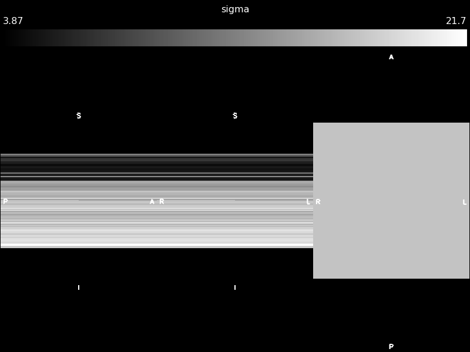
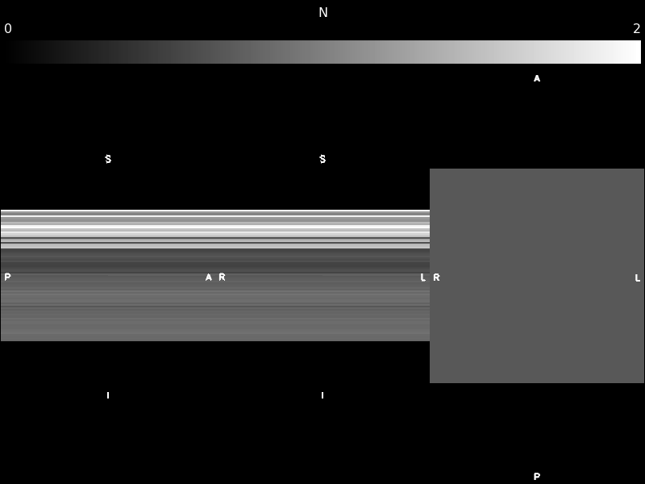
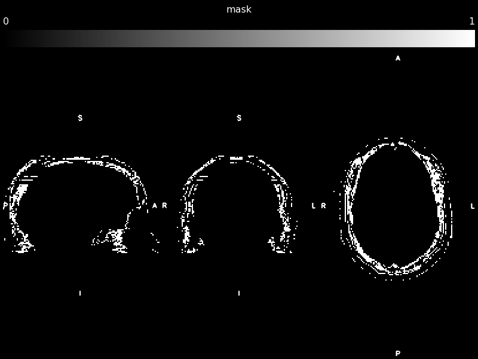

Each voxels indicates the parameters of the distribution. Here we assume that an axial slice contains the same distribution,
so if we look at an axial view we would only see a single value while the other dimensions are constant slices.

2. With equations using the maximum likelihood (with the option `-m maxlk`)

~~~bash
autodmri_get_distribution dwi_1_8.nii.gz sigma_maxlk.nii.gz N_maxlk.nii.gz mask_maxlk.nii.gz -m maxlk
~~~

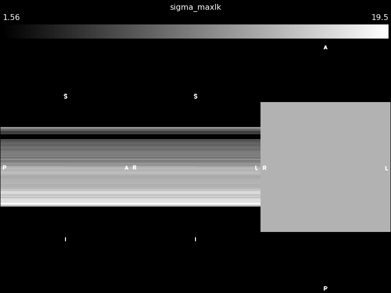
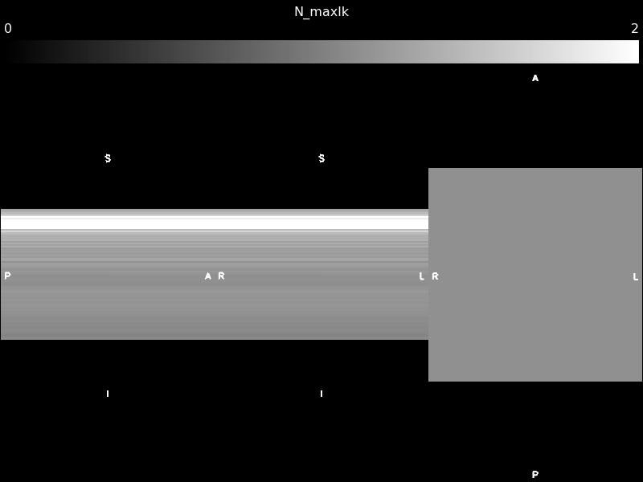
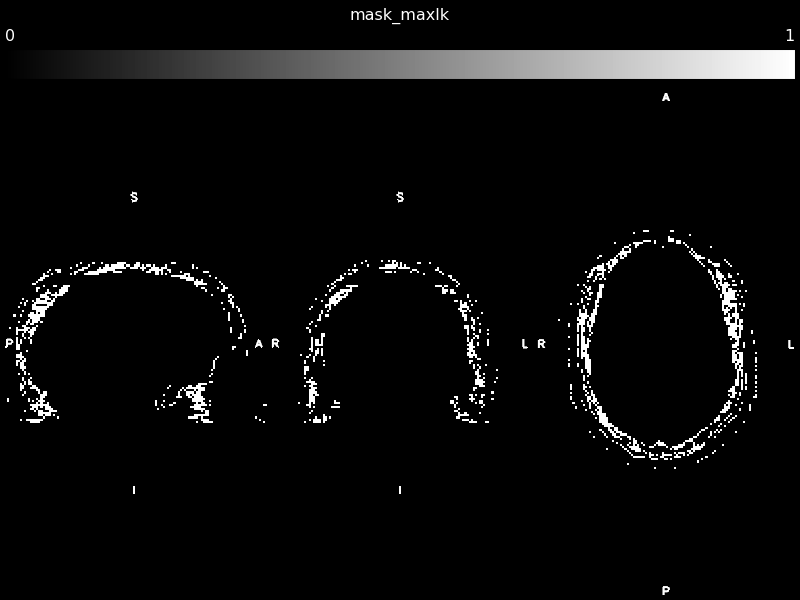

### Estimating distributions from noise maps

For estimation with noise maps, we use a scanned noise map dataset from [here](https://github.com/samuelstjean/autodmri/raw/master/datasets/data_SENSE3_MB3_noisemap.nii.gz).
You can find a few more datasets in the repository [here](../datasets) or even everything from the manuscript over at [Zenodo](https://zenodo.org/record/3339158).
The data looks like this, acquired from a water bottle phantom

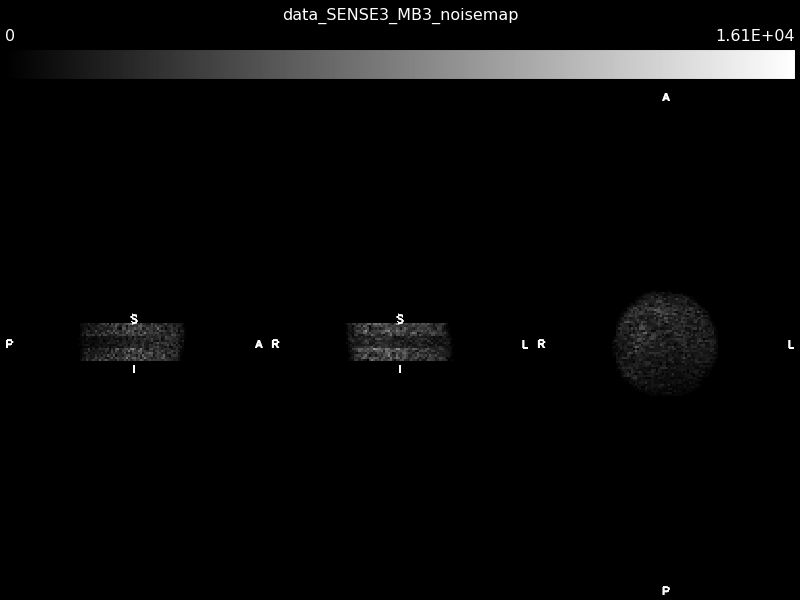

To use estimation over small local windows, we have to add the option `--noise_maps`.
Notice how every output is now a full fledged 3D maps.

1. With equations using the moments

~~~bash
autodmri_get_distribution data_SENSE3_MB3_noisemap.nii.gz sigma_nmaps.nii.gz N_nmaps.nii.gz mask_nmaps.nii.gz --noise_maps
~~~

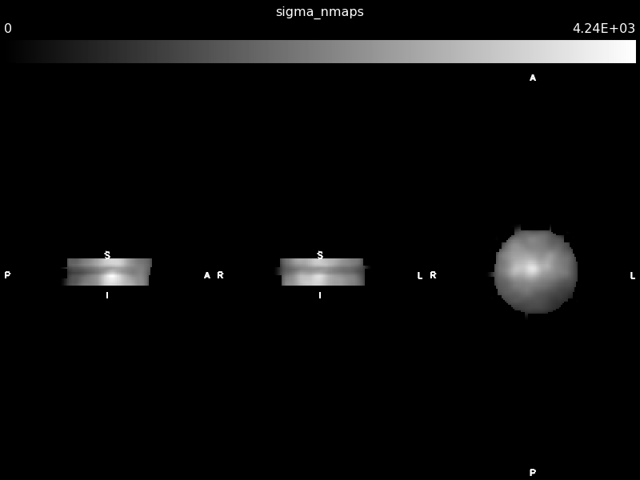

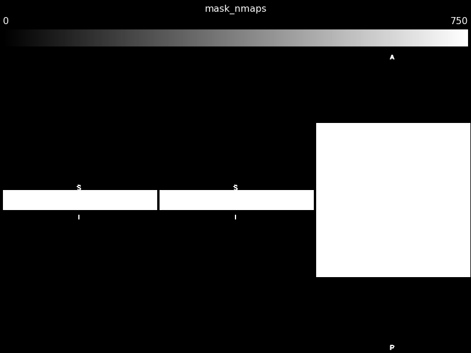

2. With equations using the maximum likelihood

~~~bash
autodmri_get_distribution data_SENSE3_MB3_noisemap.nii.gz sigma_maxlk_nmaps.nii.gz N_maxlk_nmaps.nii.gz mask_maxlk_nmaps.nii.gz -m maxlk --noise_maps
~~~

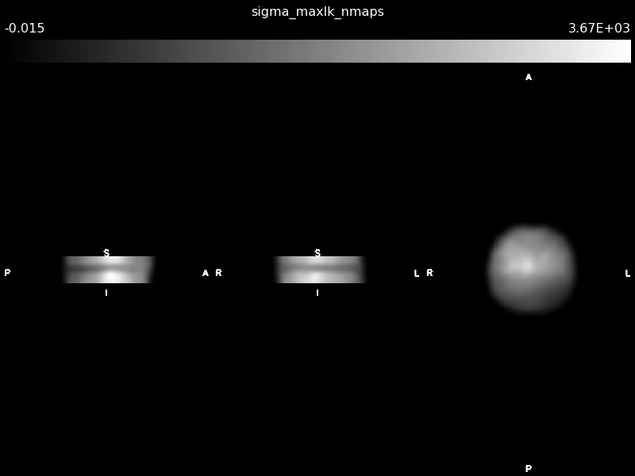
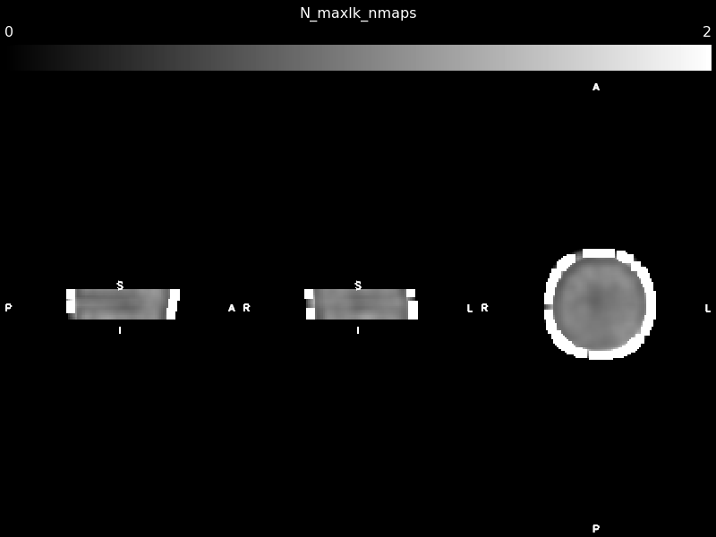
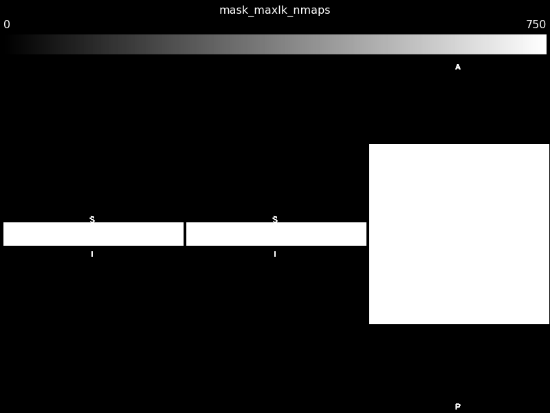
